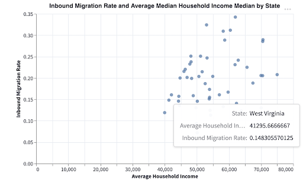

# Project Writeup: Reasons of Young Adult Migration

Team Member: Cuiting Li, Haoyu Wang, Xinzhu Wang, Darren Butler, Yue Sun

Dec 8 2022 

**[Project URL](https://cmu-ids-fall-2022-final-project-migration-x-grou-welcome-xfpxlx.streamlit.app/)**

**[Video URL](https://www.youtube.com/watch?v=5ZyIq0oZ7W0)** 

**Abstract**: Young adults entering the workforce are important to economic development, but some states in the U.S. see more migration of young adults than others, leading to inequities in workforce development. Information on migration patterns of young adults can be useful for stakeholders in economic development such as policy makers and employers. Therefore, we created an interactive data science application that allows stakeholders in economic development to interpret migration patterns of young adults from their state.

# Introduction - Project Overview and High-level Goal

Young adults entering the workforce are important to economic development, but some states in the U.S. see more migration of young adults than others, leading to inequities in workforce development. Therefore, we decided to develop an interactive data science application that will allow stakeholders such as policymakers and young people to interpret migration patterns of young adults from their state.

We use the dataset Migration Pattern of Young Adults to explore migration patterns of young people such as inbound rate and outbound rates for different states, age migration rate, popular migration routes, etc.

Migration Pattern of young adults: [https://data.migrationpatterns.org/MigrationPatternsData.zip](https://data.migrationpatterns.org/MigrationPatternsData.zip)

On top of the migration pattern, we also use another three datasets to explore factors that might affect migration rates including household income, education resources and job market.

## Research Questions 

1. At what rates did states’ young adult populations decrease and increase?
    1. Which states had the highest and lowest outbound and inbound migration rates?
    2. Where did young adults from each state migrate too?
    3. What were the popular migration destinations for each state?
    4. Are there any popular migration routes?
    5. Are there any differences in migration patterns with regard to race?
2. Which economic factors might impact young adults' decision to migrate from one state to another?
    6. Is there any correlation between household income and inbound rates?
    7. Is there any correlation between education resources and inbound rates?
    8. Is there any correlation between employment rates and inbound rates?

# Related work

The idea of our project was inspired by the Migration Patterns project ([https://migrationpatterns.org/](https://migrationpatterns.org/)) done by Darkhorse Analytics, where they analyzed where people moved as young adults. The published project specifically focuses on three questions: How far do people migrate between childhood and young adulthood? Where do they go? How much does one's location during childhood determine the labor markets that one is exposed to in young adulthood?

The project was composed on the county level, where we found that the state-level statistics information is not easily visible/obtained from the application. What we found interesting is that the project integrated the parental income level and race as selectable variables for the users to navigate in the application, but they did not do a good job analyzing the correlations between the parental income level/race and migration and how it plays a role in the migration pattern. In addition, the published project focused mainly on the migrations initiated by job changes but did not consider other factors like pursuing education, job market, living cost, etc. 

Based on those findings, we decided to create an application targeting the state-level migration analysis with different migration patterns (in-bound, out-bound, within-state), and what factors play a role in those migrations. 

# Methods - Data Selection, EDA, and Preprocessing

## What went well

We successfully did a wide-scope analysis by using external datasets. While the original migration dataset is limited in terms of the variable dimensions (only parental income and race are recorded), we take advantage of the rich datasets in authoritative websites such as the [United States Census Bureau](https://www.census.gov/programs-surveys/saipe/data/datasets.html). In this way, we are able to explore the possible relationship between migration rates and major factors such as the economic developmental level, educational ratio, and job markets.

## Obstacles

The dataset we work with is over 100MB, so we thought about taking a small sample. However, as we also need to link this dataset with external datasets, we decided to keep it consistent and use it as it is. To load the large dataset into the git repository, we divided it into multiple smaller datasets and merged them later to solve the over-size problem.

Also, faced difficulties using streamlits map implementation so we had to switch to using folium which restricted our ability to link maps with other visualizations.

# Results - Description of the system 

## Overview of Young Adult Migration

### Inbound vs Outbound Rates

We looked at which states had the rate of inbound and outbound migration of young adults for each state in relation to the amount of young adults from each state. This allowed us to determine which states' young adult populations increased most during the time period between years 2010 - 2018.  

The sample includes all children who are born in the U.S. between 1984-92. The original states of adults were recorded when each adult was about 16 years old between the years 2000 and 2008. Their final destinations were recorded at about 26 years old between the years  2010 and 2018. 

For inbound rates, New Hampshire, Vermont, and Wyoming have the highest rate of incoming young adults moving into the states. Their young adult populations increased by larger rates than other states. For outbound rates, we found that Colorado, Nevada, and DC have the highest rate of departing young adults moving from the states. Their young adult populations decreased by larger rates than other states.

### Migration by State

We created a visualization to allow users to see how young adults migrated from states of their choice. For example, we can see that most young adults migrating from Montana went to Washington. Interestingly, more adults from Montana migrated to Colorado than Idaho, which is a closer border state.

### Migration rate by state and race

The race Black reached its peak in Hawaii, Asian peaked in Kansas, and Hispanic peaked in Vermont. The Hawaii Population from the Hawaii government website also shows that from 2000 to 2010, the Black or African American population dropped by 2.6%.

On the other side, race Black's lowest point is in Maryland; race Hispanic's lowest point is in Illinois; race Asian's lowest point is in New York.

### Popular Migration Routes

#### 1st Dimension: Outbound Migration

* The top 5 states with the highest outbound migration rates are New Hampshire, Vermont, Wyoming, Connecticut, and New Jersey. Among these 5 states, 4 out of 5 are from the east coast. On the opposite side, the top 1 state with the lowest outbound migration rate is California, located on the west coast. It seems young adults from the east coast tend to move around.
* By looking further at popular migration routes for the top 1 state – New Hampshire, per outbound rate, we see that Massachusetts, Maine, New York, and California are the top 4 destination states for young adults of New Hampshire migrated to.
* The correlation score between higher education and migration rate shows a positive relationship between higher education rate and inbound migration rate. Therefore, education is one factor attracting young adults to migrate out, as New York and Massachusetts are the top 2 states per education score.

#### 2nd Dimension: Inbound Migration Pattern Analysis

The most popular 5 states per inbound migration rates are Colorado, Nevada, DC, North Dakota, and Alaska. And all of them are not located on either east or west coast.

* For Colorado and Nevada, most of the young migrants are from California. On the other side, Michigan, Ohio, New Jersey, Pennsylvania, and Mississippi are the least popular five states per inbound migration rates.
* Most young adults migrated from California by discovering the migration routes for the top 2 popular states. By viewing the two charts above, we can see that Nevada's young adults' migration pattern is very skewed, with 43% coming from California. In addition, Texas ranks #2 for both Colorado and Nevada but more young adults from Texas migrated to Colorado than Nevada.

#### 3rd Dimension: Within-State Migration

Even though California is the No.1 state for the most popular destination Colorado, young adults from California have a higher stay-in-home state rate than young adults from any other state. In contrast, young adults from Wyoming tend to move out.

## Factors influencing migration rate

With the purpose to explore deeply and analyze various factors that might have an impact on migration, we visualized and analyzed external datasets, including household income, educational ratio, and employment rate.

In order to make our app reader-friendly, we create analysis of the three factors in similar structures, so that users could read and understand the information with less cognitive load. 

### Factor 1: Economic Level

The economic level is an important metric in terms of an area’s attractiveness to young people. Based on some basic research, we decide to use the household income data as the main metric to represent a state’s economic development level, because it’s commonly used in the field of economy and also has authoritative and reliable data sources. We aggregated each state’s household income median by calculating the average of household income median from 2010 to 2018, which is the time period when the population in the migration dataset reached the age of 26 and their migration destinations are recorded.

We firstly created two maps to visualize the nationwide distribution of the household income in comparison to the inbound migration rate. In this side-by-side view, users will be able to easily compare the two distributions and get a basic overview of the similarities and differences between household incomes and inbound migration rate.

We then created a scatter plot to display how household income and inbound migration rate are related in a more intuitive way. We also calculated the correlation coefficient between these two factors, which provided an accurate evaluation of the correlation relationship.

In addition, considering the transparency to users, we also indicate the data source and clarify how the core metrics are calculated in each factor analysis part.

### Factor 2: Education

Education is a big factor affecting young people’s migration destination. We obtained data from the government website, which contains authoritative information about education obtained by educational level by county for each state each year. We calculated each state’s educational ratio by year from 2013 - 2018 and aggregated the six years' data together. 

We created two maps to visualize the nationwide distribution of the educational ratio in comparison to the inbound migration rate. In this side-by-side view, users will be able to easily compare the two distributions and get a basic overview of the similarities and differences between the educational ratio and inbound migration rate.

To provide a more intuitive visualization, we then created a scatter plot to display how the educational ratio and inbound migration rate are related. We also calculated the correlation coefficient between these two factors, which provided an accurate evaluation of the correlation relationship.

In addition, considering the transparency to users, we also indicate the data source and clarify how the core metrics are calculated in each factor analysis part.

### Factor 3: Job Market

As we all know, a good job market is a great incentive for people to migrate from one place to another. In this section, we intend to explore the correlation between the employment rate and migration rates in all US states. 

The dataset for the analysis is a data set called _ACS 5-Year Estimates Equal Employment Opportunity _from the U.S. Census Bureau website. This dataset contains the total number of employment and percentage of employment of population age 16 and over of different counties in different states from 2010-2021 which is the time frame for the period we want to investigate. 

This is the url of the source of the data: [https://data.census.gov/table?q=job+opening+by+county&tid=ACSDP1Y2021.DP03](https://data.census.gov/table?q=job+opening+by+county&tid=ACSDP1Y2021.DP03)

For data clean and data aggregation, we average employment rates of all the years from 2010-2021 and then aggregate the county data into state level by getting their averages as well. 

For data visualization, we firstly created two maps to visualize the nationwide distribution of the employment rate in comparison to the inbound migration rate also in the side by side format to help readers to easily compare the two distributions and get a basic overview of the similarities and differences.

To provide a more intuitive visualization, we then created a scatter plot to display how the employment ratio and inbound migration rate are related. We also calculated the correlation coefficient between these two factors, which provided an accurate evaluation of the correlation relationship.

# Discussion -  Interesting findings

One interesting finding is that key factors of a state, including household income, educational ratio, and employment rate, do not have as strong correlation with young adults’ migration possibility as we expected. For all of the three factors, the correlation coefficient with inbound migration rate is low, with the biggest value of 0.2. After discussing and doing some research, we concluded that the geographical migration pattern is far more complex than direct intuition. Even though core factors such as economic developmental levels, education levels, and job markets have a possibly positive relationship with young people’s willingness to migrate, one single factor does not play a significantly important role in the overall migration rate.

Another finding is that of the three external factors, the educational ratio has the least strong correlation with inbound migration rate. This might indicate that when young people make migration decisions, states’ higher education levels are less important than economical developmental levels and job markets. A possible reason might be that young people have other factors to consider when choosing where to go to universities, such as distance to hometown, tuition, and life interest. Besides, not all young people choose to go to universities or colleges.

# Future work

One tradeoff we made in this project is choosing the state-level analysis instead of a smaller granularity such as commuting zones. Because of the large amount of data, streamlit and our personal laptops have rather limited capabilities to deal with tens of thousands of data rows, and therefore we aggregate the original dataset to state-level. With this lesson being learned, we would take serious consideration of the data amount and calculating capability in our next project, and try to manage big data in a better way.

